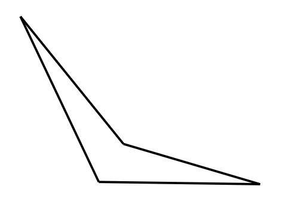

# DATO: Design Architectural Tessellation Optimizer
A Gonzaga University Senior Design Project

Developed by: Kevin Mattappally, Mauricio Velazquez, Parker Mooseker, and Aaron Dodge

## About

## Application Overview

## Image and CSV Uploading

*caption for concave quad*

## Recommendations

## Base Unit Editing

## Tessellation Engine

## Saving State and Exporting
