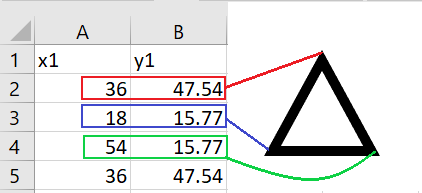

# DATO: Design Architectural Tessellation Optimizer
**A Gonzaga University Senior Design Project**

**Developed by: Kevin Mattappally, Mauricio Velazquez, Parker Mooseker, and Aaron Dodge**

## About
Architects who design the exterior facade and interior layout of a structure are often inspired by geometric shapes from mathematics, nature, and history. This inspiration often manifests itself in the form of tessellations, an arrangement of geometric shapes laid together to fill a plane. Tessellations are incorporated into many designs that we see every day, appearing on everything from building facades, to carpet patterns, to the pathways we walk across on our university campus. These patterns are vital for providing character to the structures we depend on and ensure that our world is full of unique and interesting designs. The issue with the design and implementation of tessellations is that it is difficult and time consuming. This is largely due to a lack of dedicated, easy to use software that helps support architects’ artistic expression. While its fairly trivial to develop a simple pattern, it's a challenge to  create something truly unique and eye catching. 

Our solution for this problem is DATO, the Design Architectural Tessellation Optimizer. Our app provides a dedicated product for tessellation design inspired by architectural expression. With the intention of supporting an architect’s artistic agency our application has an intuitive workflow that allows architects to quickly and easily design a plethora of patterns and explore new creative avenues they may never have previously considered. Our application allows users to upload an image of a real-world object or hand-drawn sketch that has its geometric properties extracted to create a base unit for a tessellation. The application allows users to edit the generated base unit and recommends alternative base units that can be constructed from the automatically generated one. Once the user has created a base unit they are happy with they are able to modify an automatically generated tiling to fit their exact needs.  Once the user is happy with their created tessellation, they will be able to export it both as a CSV file for use in their architectural projects. Having robust, dedicated digital technology for designing tessellations will greatly expedite the work of architects who need to create these patterns while the recommendation system will support artistic expression by showing alternative designs that architects may never have previously considered. 

## Application Overview

## Image and CSV Uploading

*caption for concave quad*

## Recommendations

*Recommended base units created using user's base unit*

## Base Unit Editing

*Editable base unit and controls*

## Tessellation Engine

*Tiling and tiling controls*

The tessellation engine is the area on the right half of the screen. This region displays the user's created tilings and provides a series of controls for editing that tiling. The polygons in the tiling are displayed in a 5x5 grid in "freeform" type initially. Freeform means that the polygons are being tiled utilizing their bounding box. This means there will be no overlaping polygons at first but will likely be spaces in between them. The recommendations on the far left of the screen tile the polygons as either "parallelogram" or "hexagon" types which are edge to edge tilings with no spaces in between polygons. Changing edges or points on the base unit will reset all changes on the tessellation engine. The save state button should always be used before changing one's base unit if meaningful work has been done on the tessellation engine.

### Sliders:

**Rotation:** rotates each polygon in the tiling by the amount specified in the textbox. Values can also be entered into the textbox to rotate polygons without dragging the slider

**Horizontal Spacing:** increases or decreases the horizontal distance between each polygon. The size of the polygons may shrink in order to keep the tiling within the bounds of the window.

**Vertical Spacing:** increases or decreases the vertical distance between each polygon. The size of the polygons may shrink in order to keep the tiling within the bounds of the window.

**Scale:** increases or decreases the size of each polygon. Will not scale the polygons larger than the size of the window.

### Right Side Buttons:

**Alternate Columns:** Flips each polygon in every other column across its center horizontally 

**Alternate Rows:** Flips each polygon in every other row across its center vertically

**Flip Vertically:** Flips every polygon across its center vertically 

**Flip Horizontally:** Flips every polygon across its center horizontally

**Toggle Freeform:** If a recommendation has been selected that is either of the parallelogram or hexagon type this button will change the tiling to a freeform bounding box tiling instead of an edge-to-edge with no empty space tiling. Clicking the button again will reset the tiling to be edge to edge

### Top Buttons:

**Save State:** Saves the current state of the tiling to easily return to a certain point after making changes. Saved states are added to the recommendation buttons on the far left of the window as buttons with red backgrounds. Saved states are not maintained after closing and reopening the app and should be exported for permanent storage.

**Export:** Opens a file dialog where users can navigate to a folder on their system to save their tiling as a CSV file. Two different CSV files are exported. The one that is just the name that the user saved it as contains metadata about the tiling and can be selected from the title screen's load existing CSV option to continue editing. The one with \_raw appended to the user's named files just contains the coordinates of the tiling at time of export and can be used in AutoCAD or other programs. In the raw CSV file every two columns represents a polygon and the two cells next to one another in the columns represent a single point. Note that the first point appears twice because it is needed for closing the drawn polygons. Refer to the below image for raw CSV formatting.

*Formatting of raw CSV output*

